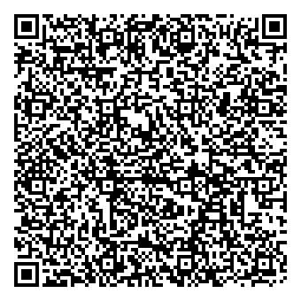
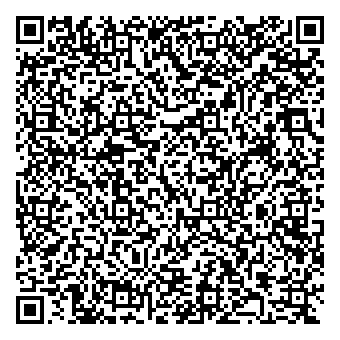

# NZ COVID Pass - Technical Specification v1

This repository is home to the technical specification for the New Zealand COVID Pass.

The New Zealand COVID Pass is a cryptographically signed document which can be represented in the form of a QR Code that enables an individual to express proof of having met certain health policy requirements in regards to COVID-19 such as being vaccinated against the virus.

## Terminology

The key words "MUST", "MUST NOT", "REQUIRED", "SHALL", "SHALL NOT", "SHOULD", "SHOULD NOT", "RECOMMENDED", "NOT RECOMMENDED", "MAY", and "OPTIONAL" in this document are to be interpreted as described in BCP 14 [[spec-norm:RFC2119]], [[spec-norm:RFC8174]] when, and only when, they appear in all capitals, as shown here.

## Data Model

The New Zealand COVID Pass is a digitally signed payload optimised for rendering via a 2D barcode for easy machine verifiability.

At an abstract level, regardless of the underlying pass type, the common elements contained within a pass are:

- Issuer Identifier: The party who issued the pass.
- Issuance Date: Datetime when the pass is valid from. NOTE - This datetime can be in the future.
- Expiration Date: Datetime when the pass expires.

See the [Pass Types](#pass-types) section for more details on the additional data elements present in each pass type.

### CWT Claims

`cti`: CWT Token ID, this claim represents a unique identifier for the pass, it **MUST** be present and its decoded value **MUST** be a valid UUID in the form of a URI as specified by [[spec-norm:RFC4122]]. The value of this identifier **MUST** be assigned in a manner that ensures that there is a negligible probability that the same value will be accidentally assigned to a different pass. It is **RECOMMENDED** that the UUID be generated in accordance with version 4 as specified by [[spec-norm:RFC4122]]. This claim is mapped to the ([Credential ID](https://www.w3.org/TR/vc-data-model/#identifiers)) property in the W3C VC standard. The claim key for `cti` of `7` **MUST** be used.

`iss`: Issuer, this claim represents the party who issued the pass, it **MUST** be present and its decoded value **MUST** be a [Decentralized Identifier](https://www.w3.org/TR/did-core/) who's [DID Method](https://www.w3.org/TR/did-core/#dfn-did-methods) **MUST** correspond to `web` which is defined by the [did:web](https://w3c-ccg.github.io/did-method-web/) specification. Verifying parties **MUST** validate this field via the verification rules outlined in [section 6](#issuer-identifier) This claim is mapped to the ([Credential Issuer](https://www.w3.org/TR/vc-data-model/#issuer)) property in the W3C VC standard. The claim key for `iss` of `1` **MUST** be used.

`nbf`: Not Before, this claim represents the earliest datetime at which the pass is considered valid by the party who issued it, this claim **MUST** be present and its value **MUST** be a timestamp encoded as an integer in the NumericDate format (as specified in [[spec-norm:RFC8392]] section 2). Verifying parties **MUST** validate that the current datetime is after or equal to the value of this claim and if not they **MUST** reject the pass as not being active. This claim is mapped to the [Credential Issuance Date](https://www.w3.org/TR/vc-data-model/#issuance-date) property in the W3C VC standard. NOTE - As per the standard this date can be sometime in the future, from when the pass is created. The claim key for `nbf` of `5` **MUST** be used.

`exp`: Expiry, this claim represents the datetime at which the pass is considered expired by the party who issued it, this claim **MUST** be present and its value **MUST** be a timestamp encoded as an integer in the NumericDate format (as specified in [[spec-norm:RFC8392]] section 2). Verifying parties **MUST** validate that the current datetime is before the value of this claim and if not they **MUST** reject the pass as being expired. This claim is mapped to the [Credential Expiration Date](https://www.w3.org/TR/vc-data-model/#expiration) property in the W3C VC standard. The claim key for `exp` of `4` **MUST** be used.

`vc`: Verifiable Credential CWT claim, this claim **MUST** be present and its value **MUST** follow the structure of [verifiable credential claim structure](###verifiable-credential-claim-structure). This claim is mapped to the [JWT Verifiable Credential claim](https://www.w3.org/TR/2019/REC-vc-data-model-20191119/#json-web-token). The `vc` claim is currrently unregistered and therefore **MUST** be encoded as a Major Type 3 string as defined by [[spec-norm:RFC7049]].

#### Mapping JTI <-> CTI

The JTI claim as defined by [JWT](https://datatracker.ietf.org/doc/html/rfc7519) represents a unique identifier for the token, in the context of the [W3C Verifiable Credentials Data Model 1.0](https://w3c.github.io/vc-data-model) this claim is mapped to the [Credential ID](https://www.w3.org/TR/vc-data-model/#identifiers) property. [CWT](https://datatracker.ietf.org/doc/html/rfc8392) defines an equivalent claim to [JTI](https://datatracker.ietf.org/doc/html/rfc7519#section-4.1.7) known as [CTI](https://datatracker.ietf.org/doc/html/rfc8392#section-3.1.7). However, due to the fact that the value type of the CTI claim (byte string) is different to the JTI claim (string) a value mapping is required. Furthermore, in its decoded form as per the [W3C Verifiable Credentials Data Model 1.0](https://w3c.github.io/vc-data-model) the resulting JTI claim **MUST** be a valid URI.

To meet these requirements the decoded form of this CTI claim value **MUST** be a valid UUID as defined by [[spec-norm:RFC4122]], the following is an example of such form:

```
urn:uuid:f81d4fae-7dec-11d0-a765-00a0c91e6bf6
```

In addition to this the following encoding and decoding rules apply to this claim. Whereby the process of encoding refers to transformation of the string based value representation to its equivalent byte string representation (JTI -> CTI). And the process of decoding refers to the transformation of the byte string representation to its equivalent string based representation (CTI -> JTI).

**Encoding**

Given a valid UUID URI form (`urn:uuid:f81d4fae-7dec-11d0-a765-00a0c91e6bf6`)

1. Parse the 128 bit UUID from the input URI (`f81d4fae-7dec-11d0-a765-00a0c91e6bf6`)
2. Parse the representative 16 bytes from the UUID in big-endian format (bytes expressed in hexadecimal `f8 1d 4f ae 7d ec 11 d0 a7 65 00 a0 c9 1e 6b f6`)

**Decoding**

Given a valid UUID in binary form (bytes expressed in hexadecimal `f8 1d 4f ae 7d ec 11 d0 a7 65 00 a0 c9 1e 6b f6`)

1. Parse the 16 byte value and convert to hexadecimal form (`f81d4fae7dec11d0a76500a0c91e6bf6`)
2. In accordance with the ABNF syntax defined by [[spec-norm:RFC4122]] split the resulting hexadecimal string along the 4-2-2-2-6 hex octet pattern. (`f81d4fae-7dec-11d0-a765-00a0c91e6bf6`)
3. Prepend the prefix of `urn:uuid` to the result obtained (`urn:uuid:f81d4fae-7dec-11d0-a765-00a0c91e6bf6`)

### CWT Headers

`kid`: This header **MUST** be present in the protected header section of the `COSE_Sign1` structure. The claim key of `4` is used to identify this claim. Its value corresponds to a relative reference to the key used to verify the pass, which **MUST** be combined with the value in the `iss` claim in the payload in accordance with the processing rules outlined in [section 6](#issuer-identifier). This value **MUST** be encoded as a Major Type 3 string as defined by [[spec-norm:RFC7049]].

`alg`: Algorithm as per [Cryptographic Digital Signature Algorithm](#cryptographic-digital-signature-algorithm). The claim key of `1` is used to identify this claim. It **MUST** be present in the protected header section of the `COSE_Sign1` structure and its claim value **MUST** be set to the value corresponding to `ES256` algorithm registration, which is the numeric value of `-7` as per [IANA](https://www.iana.org/assignments/cose/cose.xhtml) registry.

### Verifiable Credential Claim Structure

The following section outlines the additional normative requirements around the contents of the `vc` claim value as defined in the [W3C Verifiable Credentials standard](https://w3c.github.io/vc-data-model/#json-web-token).

`@context`: JSON-LD Context property for conformance to the [W3C VC standard](https://w3c.github.io/vc-data-model/#contexts). This property **MUST** be present and its value **MUST** be an array of strings where the first value **MUST** equal `https://www.w3.org/2018/credentials/v1`.

The following is an example including an additional JSON-LD context entry that defines the additional vocabulary specific to the New Zealand COVID Pass.

```json
["https://www.w3.org/2018/credentials/v1", "https://nzcp.covid19.health.nz/contexts/v1"] 
```

`type`: Type property for conformance to the W3C VC standard. This property **MUST** be present and its value **MUST** be an array of two string values, whose first element is `VerifiableCredential` and second element corresponds to one defined in the [pass types section](#pass-types).

Example

```json
["VerifiableCredential", "PublicCovidPass"]
```

`version`: Version property of the New Zealand Covid Pass. This property **MUST** be present and its value **MUST** be a string who's value corresponds to a valid version identifier as defined by [semver](https://semver.org/). For the purposes of this version of the specification this value **MUST** be `1.0.0`.

`credentialSubject`:  Credential Subject property **MUST** be present and its value **MUST** be a JSON object with properties determined by the declared [pass type](#pass-types) for the pass.

### Pass Types

Within the New Zealand COVID Pass the concept of a pass type exists due to the association to the [W3C Verifiable Credentials Data Model 1.0](https://w3c.github.io/vc-data-model).

As stated by the standard in the [type section](https://www.w3.org/TR/vc-data-model/#types), a Verifiable Credential **MUST** include a type property with a value which includes "VerifiableCredential". 

For the purposes of the New Zealand COVID Pass the Verifiable Credential **MUST** also include one of the following types.

- PublicCovidPass

The pass types defined above communicate the type of pass that has been issued and communicates what other claims should/must be present in the `credentialSubject` property, the section below details what each type defines.

#### PublicCovidPass

When a verifiable credential features this type (`PublicCovidPass`) it is a New Zealand COVID Pass which includes the following additional information in the `credentialSubject` property.

- givenName: (REQUIRED, MAX LENGTH: 100) Given name(s) of the subject of the pass.
- familyName: (OPTIONAL, MAX LENGTH: 100) Family name(s) of the subject of the pass.
- dob: (REQUIRED) Date of birth of the subject of the pass, in ISO 8601 date format (YYYY-MM-DD).

Below is an example decoded CWT payload of a `PublicCovidPass` where the CWT claims have been mapped to their JWT counterparts.

```json
{
    "iss": "did:web:example.nz",
    "nbf": 1516239022,
    "exp": 1516239922,
    "jti": "urn:uuid:cc599d04-0d51-4f7e-8ef5-d7b5f8461c5f",
    "vc": {
        "@context": [ "https://www.w3.org/2018/credentials/v1", "https://nzcp.covid19.health.nz/contexts/v1" ],
        "version": "1.0.0",
        "type": [ "VerifiableCredential", "PublicCovidPass" ],
        "credentialSubject": {
            "givenName": "John Andrew",
            "familyName": "Doe",
            "dob": "1979-04-14"
        }
    }
}
```

### Relationship to W3C VC Data Model

The [W3C Verifiable Credentials Data Model 1.0](https://www.w3.org/TR/vc-data-model) standard specifies an abstract data model for expressing information that is verifiable through the usage of cryptographic digital signatures. Although the primary representation format discussed in the standard is [[spec-norm:JSON-LD]] with [Linked Data Proofs](https://w3c-ccg.github.io/ld-proofs/) as the proof format. The standard is agnostic to other proof formats.

Excerpt from [Proof formats](https://www.w3.org/TR/vc-data-model/#proof-formats) section of the specification:

> The data model described in this specification is designed to be proof format agnostic. This specification does not normatively require any particular digital proof or signature format.

Due to the unique requirements of the New Zealand COVID Pass including the requirement that the overall expression be en-codable into a QR Code that is easily scannable, the data model is encoded using [[spec-norm:RFC7049]] and CWT as defined by [[spec-norm:RFC8392]] as the proof format.

Furthermore, within the the [W3C Verifiable Credentials Data Model 1.0](https://w3c.github.io/vc-data-model) encoding with the proof format of [JWT](https://www.w3.org/TR/vc-data-model/#json-web-token) is defined. Due to the relationship CWT and [JWT](https://datatracker.ietf.org/doc/html/rfc7519) share including common claim registrations in the [COSE IANA registry](https://www.iana.org/assignments/cose/cose.xhtml), the JWT encoding can be directly mapped to CWT.

## Cryptographic Digital Signature Algorithm Selection

COSE [[spec-norm:RFC8152]] is a general purpose digital signature encoding format that supports several different cryptographic algorithms, however for the purposes of promoting secure and interoperable implementations all New Zealand COVID Passes **MUST** use Elliptic Curve Digital Signature Algorithm (ECDSA) as defined in (ISO/IEC 14888–3:2006) section 2.3, using the P–256 parameters as defined in appendix D (D.1.2.3) of (FIPS PUB 186–4) in combination with the SHA–256 hash algorithm as defined in FIPS PUB 180-4.

This algorithm corresponds to `ES256` in the [COSE IANA Algorithm Registry](https://www.iana.org/assignments/cose/cose.xhtml).

COSE [[spec-norm:RFC8152]] supports two sign structures `COSE_Sign` and `COSE_Sign1`, with the primary difference being that the former supports multiple signatures whilst the latter does not. For the purposes of promoting secure and interoperable implementations and there being no present requirement for multiple signatures, all New Zealand COVID Passes **MUST** use the `COSE_Sign1` structure and **MUST** use the tagged variation of the CBOR structure using the registered tag of `18` to represent this.

Verifying parties **MUST** validate the digital signature on a New Zealand COVID Pass and **MUST** reject passes that fail this check as being invalid.

## 2D Barcode Encoding

This section defines how a New Zealand COVID Pass is encoded in the form of a 2D barcode.

The QR format as defined in (ISO/IEC 18004:2015) **MUST** be used as the 2D barcode format.

The payload of the QR Code **MUST** be encoded using the alphanumeric mode, whereby the encoded string takes the following form, making it a valid URI as per [[spec-norm:RFC3986]].

```
NZCP:/<version-identifier>/<base32-encoded-CWT>
```

The payload of the QR Code **MUST** begin with the prefix of `NZCP:/`, followed by the two further payload elements described below that are delimited by a `/` character.

The `version-identifier` portion of the payload is an un-signed integer representing the major version the pass was generated with as defined by [semver](https://semver.org/) conventions. This value for this release of the specification **MUST** be `1`.

The `base32-encoded-CWT` portion on the payload **MUST** use the base32 encoding as defined by [[spec-norm:RFC4648]] **WITHOUT padding**, to encode the outputted binary payload resulting from the COSE sign operation.

::: note Removing Base32 Padding
Because the alphanumeric mode of QR codes does not include the `=` as a valid character, the padding of a base32 string represented by the `=` character **MUST** be removed prior to QR code encoding.

The following is a simple javascript snippet designed to show how an implementor can remove the padding from an input base32 string.

```javascript
const removeBase32Padding = (base32Input) => {
    return base32Input.split('=')[0]
}

// Running the following 
const payload = "MFZWS33ENBQXG2DJOBSGQ2LBONUWQ4DEMFUXA43ENBUXAYLTNBUWI===";
console.log("Base32 payload: " + payload);
console.log("Base32 payload with padding removed: " + removeBase32Padding(payload));

// Yields the following output
// Base32 payload: MFZWS33ENBQXG2DJOBSGQ2LBONUWQ4DEMFUXA43ENBUXAYLTNBUWI===
// Base32 payload with padding removed: MFZWS33ENBQXG2DJOBSGQ2LBONUWQ4DEMFUXA43ENBUXAYLTNBUWI
```
:::

::: note Adding Base32 Padding
Some base32 decoding implementations may fail to decode a base32 string that is missing the required padding as defined by [[spec-norm:RFC4648]].

The following is a simple javascript snippet designed to show how an implementor can add the required padding to a base32 string.

```javascript
    const addBase32Padding = (base32InputNoPadding) => {
        var result = base32InputNoPadding;
        while ((result.length % 8) !== 0) {
            result += '='
        }
        return result;
    }


    // Running the following 
    const payload = "MFZWS33ENBQXG2DJOBSGQ2LBONUWQ4DEMFUXA43ENBUXAYLTNBUWI";
    console.log("Base32 payload without padding: " + payload);
    console.log("Base32 payload with padding: " + addBase32Padding(payload));

    // Yields the following output
    // Base32 payload without padding: MFZWS33ENBQXG2DJOBSGQ2LBONUWQ4DEMFUXA43ENBUXAYLTNBUWI
    // Base32 payload with padding: MFZWS33ENBQXG2DJOBSGQ2LBONUWQ4DEMFUXA43ENBUXAYLTNBUWI===
```
:::

## Issuer Identifier

Establishing who issued a New Zealand Covid pass and validating is a crucial step in being able to trust the information contained within the pass.

The Decentralized Identifiers [[spec-norm:DID-CORE]] specification defines an identifier syntax and accompanying data model for representing public cryptographic information in a consistent manner.

In essence given a DID (the identifier) it can be resolved to the associated set of public keys (the did document) required to verify cryptographically signed information by the party represented by the DID.

This specification makes use of the [did:web](https://w3c-ccg.github.io/did-method-web/) DID method.

For verifying parties it is **RECOMMENDED** that prior to trying to resolve the public keys of the issuer of a New Zealand COVID Pass, the verifying party **SHOULD** first establish whether they trust the reported issuer, for example by validating the `iss` value reported in the pass matches one listed in the [trusted issuers](#trusted-issuers).

### DID Document

The public key referenced by the decoded CWT **MUST** be listed/authorized under the `assertionMethod` verification relationship in the resolved DID document.

The public key referenced by the decoded CWT **MUST** be a valid P-256 public key suitable for usage with the Elliptic Curve Digital Signature Algorithm (ECDSA) as defined in (ISO/IEC 14888–3:2006) section 2.3.

The expression of the public key referenced by the decoded CWT **MUST** be in the form of a JWK as per [[spec-norm:RFC7517]].

This public key JWK expression **MUST NOT** publish any JSON Web Key Parameters that are classified as "Private" under the "Parameter Information Class" category of the [JSON Web Key Parameters IANA registry](https://www.iana.org/assignments/jose/jose.xhtml#web-key-parameters).

This public key JWK expression **MUST** set a `crv` property which has a value of `P-256`. Additionally, the JWK MUST have a `kty` property set to `EC`.

Below is a non-normative example of a `did:web` DID Document:

```json
{
    "@context": ["https://www.w3.org/ns/did/v1", "https://w3id.org/security/suites/jws-2020/v1"],
    "verificationMethod": [{
        "id": "did:web:example.com#key1",
        "type": "JsonWebKey2020",
        "controller": "did:web:example.com",
        "publicKeyJwk": {
          "kty":"EC",
          "crv":"P-256",
          "x":"MKBCTNIcKUSDii11ySs3526iDZ8AiTo7Tu6KPAqv7D4",
          "y":"4Etl6SRW2YiLUrN5vfvVHuhp7x8PxltmWWlbbM4IFyM",
        },
    }],
    "assertionMethod": ["did:web:example.com#key1"],
    "authentication": ["did:web:example.com#key1"],
}
```

### Example - resolving an issuer's identifier to their public keys

This section outlines how a verifying party, given a valid New Zealand COVID pass, retrieves the public keys for the issuer of the pass so they can perform the cryptographic verification of the digital signature. 

Given `did:web:example.com` as the value of the `iss` claim and `key-1` as the value of the `kid` header parameter.

Perform an HTTPS GET request to `https://example.com/.well-known/did.json` with the Accept header set to `application/json`. If the request fails or response body is not valid JSON then fail verification.

Given the response body to this request as the following

```json
{
    "@context": ["https://www.w3.org/ns/did/v1", "https://w3id.org/security/suites/jws-2020/v1"],
    "verificationMethod": [{
        "id": "did:web:example.com#key1",
        "type": "JsonWebKey2020",
        "controller": "did:web:example.com",
        "publicKeyJwk": {
          "kty":"EC",
          "crv":"P-256",
          "x":"MKBCTNIcKUSDii11ySs3526iDZ8AiTo7Tu6KPAqv7D4",
          "y":"4Etl6SRW2YiLUrN5vfvVHuhp7x8PxltmWWlbbM4IFyM",
        },
    }],
    "assertionMethod": ["did:web:example.com#key1"],
    "authentication": ["did:web:example.com#key1"],
}
```

Combine the `iss` value and `kid` value separated with a `#` to get the absolute key reference (`did:web:example.com#key1`).

Check the list of elements referenced in the `assertionMethod` array contained in the document, if the property does not exist or the array does not contain the absolute key reference computed above then fail verification.

Check the returned `verificationMethod` is of type `JsonWebKey2020`, if not then fail verification.

Check the returned `verificationMethod` features a `publicKeyJwk` entry and validate that its value a valid JWK as per [[spec-norm:RFC7517]].

## Trusted Issuers

The following is a list of trusted issuer identifiers for New Zealand Covid Passes.

```json
[
  "did:web:nzcp.identity.health.nz"
]
```

A verifying party during validation of a New Zealand Covid Pass **MUST** check that the issuer of the pass, conveyed by the `iss` claim in the decoded payload matches one of those defined above.

## Examples

### Steps to verify a New Zealand COVID Pass

This section is non-normative and is intended to help those developing tools for verifying parties.

- Check if the payload received from the QR Code begins with the prefix `NZCP:/`, if it does not then fail.
- Parse the character(s) (representing the `version-identifier`) as an unsigned integer following the `NZCP:/` suffix and before the next slash character (`/`) encountered. If this errors then fail. If the value returned is un-recognized as a major protocol version supported by the verifying software then fail. NOTE - for instance in this version of the specification this value **MUST** be `1`.
- With the remainder of the payload following the `/` after the `version-identifier`, attempt to decode it using base32 as defined by [[spec-norm:RFC4648]] **NOTE** add back in padding if required, if an error is encountered during decoding then fail.
- With the decoded payload attempt to decode it as `COSE_Sign1` CBOR structure, if an error is encountered during decoding then fail.
- With the headers returned from the `COSE_Sign1` decoding step, check for the presence of the required headers as defined in [the data model section](#data-model), if these conditions are not meet then fail.
- Validate that the `iss` claim in the decoded CWT payload is an issuer you trust refer to the [trusted issuers section](#trusted-issuers) for a trusted list, if not then fail.
- Following the rules outlined in [issuer identifier](#issuer-identifier) retrieve the issuers public key that was used to sign the CWT, if an error occurs then fail.
- With the retrieved public key validate the digital signature over the `COSE_Sign1` structure, if an error occurs then fail.
- With the payload returned from the `COSE_Sign1` decoding, check if it is a valid CWT containing the claims defined in [the data model section](#data-model), if these conditions are not meet then fail. 

### Valid Worked Example

This section is non-normative and is intended to provide a worked example to help those developing tools for verifying parties.

::: note Trusted Issuer
  The issuer of this example is `did:web:nzcp.covid19.health.nz` and must be set to be a trusted issuer for the purposes of testing in order to yield the expected valid result.
:::


The payload decoded from the QR is of the following form:

```text
[[insert: ./spec/examples/valid/nzcp.txt]]
```

Decoding the base32 portion of this above string to a byte string (adding padding if required) yields the following bytes expressed in hexadecimal.

```text
[[insert: ./spec/examples/valid/nzcp-cwt-hex.txt]]
```

 Decoding this byte string as a CBOR structure and rendering it via the expanded form shown throughout [[spec-norm:RFC7049]] yields the following. Let this result be known as the `Decoded COSE structure`.

```text
[[insert: ./spec/examples/valid/nzcp-cwt-cbor-commented.txt]]
```

Decoding the byte string present in the first element of the `Decoded COSE structure`, as a CBOR structure and rendering it via the expanded form yields the following. Let this result be known as the `Decoded CWT protected headers`.

```text
[[insert: ./spec/examples/valid/nzcp-cwt-protected-headers-cbor-commented.txt]]
```

Mapping the `Decoded CWT protected headers` to JSON, substituting the numeric claim tags (e.g 1 -> `alg`, 4 -> `kid`) for their registered string equivalents yields the following.

```json
[[insert: ./spec/examples/valid/nzcp-protected-headers.json]]
```

Decoding the byte string present in the third element of the `Decoded COSE structure`, as a CBOR structure and rendering it via the expanded form yields the following. Let this result be known as the `Decoded CWT payload`.

```text
[[insert: ./spec/examples/valid/nzcp-cwt-payload-cbor-commented.txt]]
```

Mapping the `Decoded CWT payload` to JSON, substituting the numeric claim tags (e.g 1 -> `iss`, 4 -> `exp`) for their registered string equivalents.

```json
[[insert: ./spec/examples/valid/nzcp.json]]
```

Taking the value of the `iss` claim in the CWT payload and the `kid` value from the protected headers and resolving it to the issuers DID document as detailed in the [issuer identifier section](#issuer-identifier), yields the following JSON document. Located [here](./did.json).

```json
[[insert: ./spec/examples/valid/did.json]]
```

Extracting the issuers public key from the resolved DID document, yields the following public key expressed in JWK form which is required to cryptographically verify the pass.

```json
[[insert: ./spec/examples/valid/jwk.json]]
```

Using the encoded protected headers, encoded payload, issuer public key and signature value inline with the rules stipulated by [[spec-norm:RFC8152]] to performing cryptographic verification using the Elliptic Curve Digital Signature Algorithm with SHA-256 returns a valid digital signature.


::: note Example expiry
  The expiry of this example pass is 10 years from issuance which does not represent the period under-which an actual New Zealand COVID Pass would be issued for.
:::

### Invalid examples

This section is non-normative and is intended to provide a set of invalid examples to help those developing tools for verifying parties.

::: note Trusted Issuer
  The issuer of all of these examples is `did:web:nzcp.covid19.health.nz` which must be set to be trusted as an issuer for the purposes of testing in order to yield the following results.
:::

#### Bad Public Key

The following New Zealand COVID Pass features a digital signature that was signed by a different private/public key than the one resolved by the information in the pass. The expected result from validating this pass is FAIL or ERROR due to unable to validate the digital signature.


Below is the decoded contents of the QR Code

```text
[[insert: ./spec/examples/invalid/nzcp-bad-public-key.txt]]
```

#### Public Key Not Found

The following is a New Zealand COVID Pass that references a public key that is not found in the Issuers DID Document. The expected result from validating this pass is FAIL or ERROR due to not being able to obtain the public key required to verify the pass.



Below is the decoded contents of the QR Code

```text
[[insert: ./spec/examples/invalid/nzcp-not-associated-public-key.txt]]
```

#### Modified Signature

The following is a New Zealand COVID Pass that features a digital signature that has been modified in an invalid way. The expected result from validating this pass is FAIL or ERROR due to not being able to validate the digital signature.


Below is the decoded contents of the QR Code

```text
[[insert: ./spec/examples/invalid/nzcp-modified-sig.txt]]
```

#### Modified Payload

The following is a New Zealand COVID Pass that features a modified payload which invalidates the accompanying digital signature. The expected result from validating this pass is FAIL or ERROR due to not being able to validate the digital signature.


Below is the decoded contents of the QR Code

```text
[[insert: ./spec/examples/invalid/nzcp-modified-payload.txt]]
```

#### Expired Pass

The following is a New Zealand COVID Pass that is expired, which is communicated via the value of the `exp` claim. The expected result from validating this pass is EXPIRED.


Below is the decoded contents of the QR Code

```text
[[insert: ./spec/examples/invalid/nzcp-expired-payload.txt]]
```

#### Not Active Pass

The following is a New Zealand COVID Pass that is not active yet, which is communicated via the value of the `nbf` claim. The expected result from validating this pass is NOT ACTIVE.



Below is the decoded contents of the QR Code

```text
[[insert: ./spec/examples/invalid/nzcp-notactive-payload.txt]]
```

## References

### Normative

The following is a list of normative references

[[spec-norm]]

## Appendices

### JSON Schema Definitions

CWT JSON Schema definition

```json
[[insert: ./spec/schema/1.0.0/cwt.json]]
```

VC JSON Schema definition

```json
[[insert: ./spec/schema/1.0.0/vc.json]]
```

### JSON-LD Context Definition

```json
[[insert: ./spec/contexts/v1.json]]
```

### 2D Barcode Encoding Options Rational

Numerous encoding options were considered during the design of this specification

Base45 as documented in the [ietf internet draft](https://datatracker.ietf.org/doc/html/draft-faltstrom-base45-07) and used by the EU DCC is an optimal encoding set for encoding abitrary content into a QR Code via the alphanumeric mode. However due to the characters chosen to makeup the encoding set including those un-supported (e.g space ` `) or reserved for special purposes in the URI standards (e.g `$`), creates interoperability challenges. For instance many adjacent systems surrounding QR Code technology, such as mobile platforms (iOS/android) expect a decoded payload from a QR code to be a URI and as such will automatically perform certain operations like escaping invalid characters such as spaces (` `) transforming them into `%20`. This has the effect of transforming an encoded string away from its original form and hence making it un-processable to a verifier.

Example issues
- [iPhone Camera App adds unexpected %20 encoding](https://github.com/ehn-dcc-development/hcert-spec/issues/72)
- [Base45's % symbol leads to automated decoding problems](https://github.com/ehn-dcc-development/hcert-spec/issues/64)

Smart health cards which use JWT as the underlying digital signature and payload representation layer, do a custom algorithmic transform of the base64 form of a JWT into a payload compatible with numeric mode QR code encoding. This complexity is caused by JWT's having to be encoded as base64 as per the standard, this constraint does not exist with CWT and hence encoding an NZCP this way would be redundant complexity.

QR Codes do define a binary data encoding mode, which would appear to make the most sense for encoding a binary structure like a CWT. However, unfortunately most QR code generator and reader libraries enforce the ISO 8859-1 character set over this mode effectively rendering the format un-useable for binary data.
